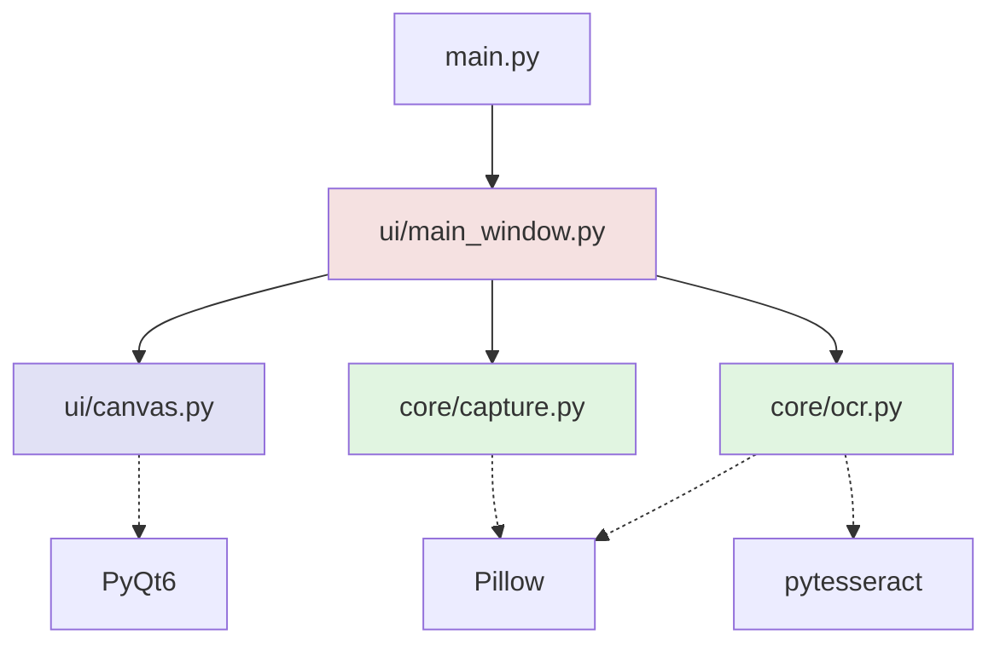
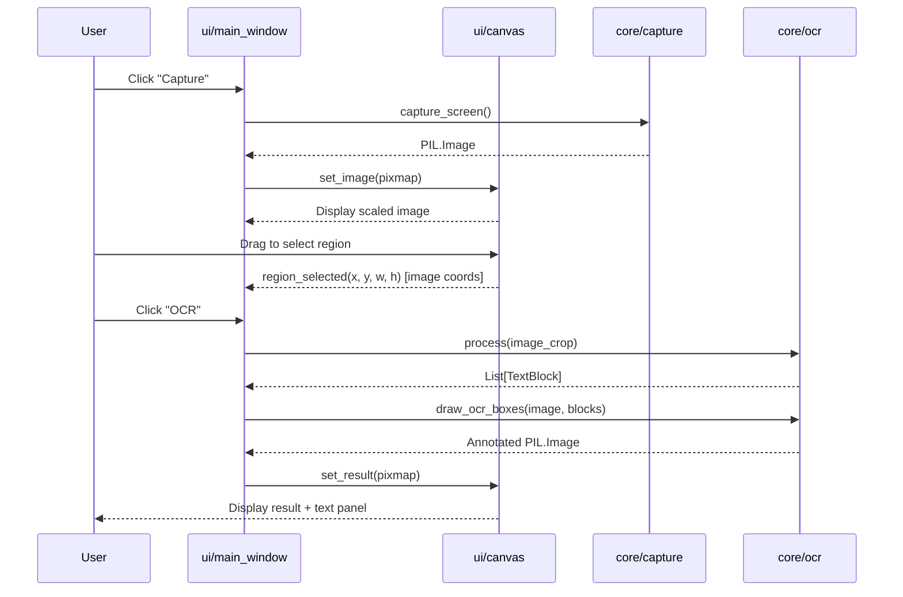
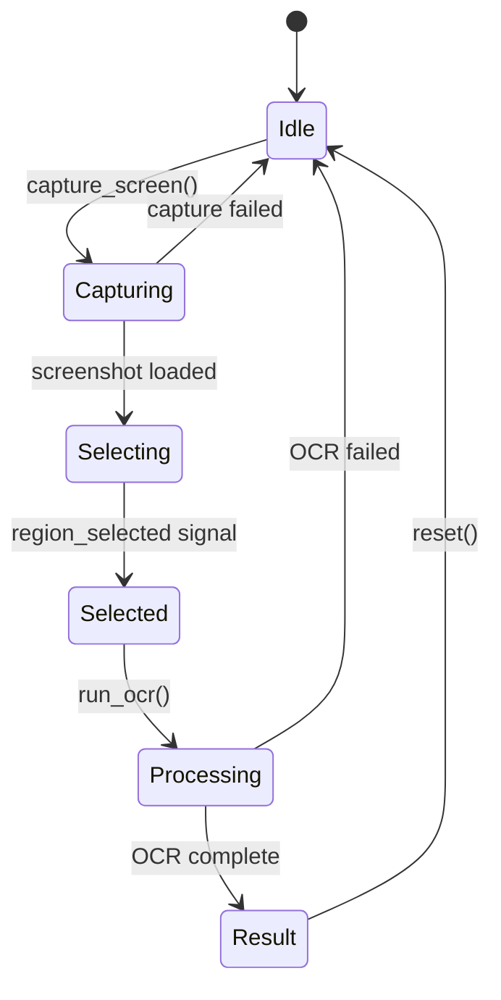

# OCR Scanner — Detailed Design Document

## 1. System Architecture

### 1.1 Module Overview

```
ocr_scanner/
├── main.py                  # Application entry point
├── core/
│   ├── capture.py           # Screen capture module (pure logic, no UI)
│   └── ocr.py               # OCR processing module (pure logic, no UI)
├── ui/
│   ├── main_window.py       # Main window, controls, orchestration
│   └── canvas.py            # Custom widget: display + region selection
└── tests/
    ├── test_capture.py
    ├── test_ocr.py
    ├── test_canvas.py
    └── test_integration.py
```

### 1.2 Module Dependency Graph



**Design Principle**: `core/` modules have zero dependency on `ui/` modules. They accept and return plain Python objects (PIL Images, dataclasses). This enables independent unit testing without PyQt6.

### 1.3 Data Flow



---

## 2. Module: `core/capture.py`

### 2.1 Responsibility

Capture the full screen at native pixel resolution. Handle multi-monitor and HiDPI/Retina displays.

### 2.2 Public Interface

```python
class ScreenCaptureError(Exception):
    """Raised when screen capture fails."""
    pass

def capture_screen(monitor: int = 1) -> Image.Image:
    """
    Capture the specified monitor at native resolution.

    Args:
        monitor: Monitor index (1-based). 0 = all monitors combined.

    Returns:
        PIL.Image.Image in RGB mode.

    Raises:
        ScreenCaptureError: If mss fails to capture (no display, permission denied).
    """
    ...

def get_monitor_count() -> int:
    """
    Return the number of available monitors.

    Returns:
        int >= 1
    """
    ...
```

### 2.3 Internal Implementation

```python
import mss
from PIL import Image

def capture_screen(monitor: int = 1) -> Image.Image:
    try:
        with mss.mss() as sct:
            monitor_data = sct.grab(sct.monitors[monitor])
            image = Image.frombytes("RGB", monitor_data.size, monitor_data.bgra, "raw", "BGRX")
            return image
    except Exception as e:
        raise ScreenCaptureError(f"Failed to capture screen: {e}") from e
```

### 2.4 Test Isolation Strategy

- **Mock `mss.mss()`** to return synthetic monitor data without actual screen access.
- Test `ScreenCaptureError` is raised when `mss.grab()` raises.
- No PyQt6 dependency — pure Python test.

---

## 3. Module: `core/ocr.py`

### 3.1 Responsibility

Run OCR on a PIL Image and return structured text blocks with bounding boxes and confidence scores. Provide utility to draw annotated bounding boxes.

### 3.2 Data Structures

```python
from dataclasses import dataclass

@dataclass
class TextBlock:
    """Represents a single OCR-detected text element."""
    text: str
    x: int          # Left coordinate (image pixels)
    y: int          # Top coordinate (image pixels)
    w: int          # Width in pixels
    h: int          # Height in pixels
    confidence: float  # 0.0 - 100.0

    @property
    def is_high_confidence(self) -> bool:
        return self.confidence > 80.0

    @property
    def is_medium_confidence(self) -> bool:
        return 50.0 < self.confidence <= 80.0

    @property
    def is_low_confidence(self) -> bool:
        return self.confidence <= 50.0
```

### 3.3 Public Interface

```python
class OCRError(Exception):
    """Raised when OCR processing fails."""
    pass

def extract_text(image: Image.Image, lang: str = "eng") -> list[TextBlock]:
    """
    Run OCR on the given image and return structured text blocks.

    Args:
        image: PIL.Image.Image (any mode, will be converted to grayscale internally).
        lang: Tesseract language code (default: "eng").

    Returns:
        List of TextBlock, sorted by reading order (top-to-bottom, left-to-right).
        Empty list if no text detected.

    Raises:
        OCRError: If Tesseract binary is not found or processing fails.
    """
    ...

def draw_ocr_boxes(
    image: Image.Image,
    blocks: list[TextBlock],
    line_width: int = 2,
) -> Image.Image:
    """
    Draw colored bounding boxes on a copy of the image.

    Color scheme:
        - Green: confidence > 80%
        - Yellow: 50% < confidence <= 80%
        - Red: confidence <= 50%

    Args:
        image: Source PIL.Image.Image.
        blocks: List of TextBlock to annotate.
        line_width: Border width in pixels.

    Returns:
        New PIL.Image.Image with boxes drawn (original unchanged).
    """
    ...

def validate_tesseract() -> bool:
    """
    Check if Tesseract binary is available on PATH.

    Returns:
        True if accessible, False otherwise.
    """
    ...
```

### 3.4 Internal Implementation

```python
import pytesseract
from PIL import Image, ImageDraw

CONFIDENCE_COLORS = {
    "high": (0, 255, 0),    # Green
    "medium": (255, 255, 0), # Yellow
    "low": (255, 0, 0),      # Red
}

def extract_text(image: Image.Image, lang: str = "eng") -> list[TextBlock]:
    try:
        data = pytesseract.image_to_data(image, lang=lang, output_type=pytesseract.Output.DICT)
        blocks = []
        for i in range(len(data["text"])):
            conf = int(data["conf"][i])
            text = data["text"][i].strip()
            if conf > 0 and text:  # Filter out empty/invalid entries
                blocks.append(TextBlock(
                    text=text,
                    x=data["left"][i],
                    y=data["top"][i],
                    w=data["width"][i],
                    h=data["height"][i],
                    confidence=conf,
                ))
        return blocks
    except Exception as e:
        raise OCRError(f"OCR processing failed: {e}") from e

def draw_ocr_boxes(image, blocks, line_width=2):
    result = image.copy().convert("RGB")
    draw = ImageDraw.Draw(result)
    for block in blocks:
        if block.is_high_confidence:
            color = CONFIDENCE_COLORS["high"]
        elif block.is_medium_confidence:
            color = CONFIDENCE_COLORS["medium"]
        else:
            color = CONFIDENCE_COLORS["low"]
        draw.rectangle(
            [(block.x, block.y), (block.x + block.w, block.y + block.h)],
            outline=color,
            width=line_width,
        )
    return result
```

### 3.5 Test Isolation Strategy

- **Mock `pytesseract.image_to_data()`** to return synthetic dict data.
- Test `OCRError` is raised when pytesseract fails.
- Test `draw_ocr_boxes` with known `TextBlock` inputs, verify pixel colors at expected coordinates.
- Test `validate_tesseract()` with and without Tesseract on PATH.
- No PyQt6 dependency — pure Python test.

---

## 4. Module: `ui/canvas.py`

### 4.1 Responsibility

Display images (screenshot or OCR result) and handle mouse-based region selection. Convert widget coordinates to image coordinates. Emit selection events.

### 4.2 Signals

```python
class Canvas(QWidget):
    # Emitted when user finishes drawing a selection rectangle.
    # Coordinates are in native image pixel space (not widget space).
    region_selected = pyqtSignal(int, int, int, int)  # x, y, w, h

    # Emitted when user double-clicks to clear selection.
    selection_cleared = pyqtSignal()
```

### 4.3 Public Interface

```python
class Canvas(QWidget):
    def __init__(self, parent=None):
        ...

    def set_image(self, pixmap: QPixmap) -> None:
        """
        Display a pixmap in the canvas, scaled to fit.
        Stores the original pixmap for coordinate conversion.
        Clears any existing selection.

        Args:
            pixmap: QPixmap to display.
        """
        ...

    def clear(self) -> None:
        """Reset canvas to empty state with placeholder text."""
        ...

    def get_selection(self) -> tuple[int, int, int, int] | None:
        """
        Return the current selection in image coordinates, or None.

        Returns:
            (x, y, w, h) in image pixel space, or None if no selection.
        """
        ...
```

### 4.4 Internal State

```python
class Canvas(QWidget):
    # Internal attributes
    _pixmap: QPixmap | None          # Original full-resolution pixmap
    _scaled_pixmap: QPixmap | None   # Scaled version for display
    _rubber_band: QRubberBand | None # Selection rectangle overlay
    _origin: QPoint | None           # Mouse press start point
    _selection_rect: QRect | None    # Current selection in widget coords
```

### 4.5 Coordinate Conversion

```python
def _widget_to_image_coords(self, rect: QRect) -> tuple[int, int, int, int]:
    """
    Convert widget-space rectangle to image-space coordinates.

    Scaling factor = _pixmap.width() / self.width()
    Applied to x, y, width, height independently.

    Returns:
        (x, y, w, h) in image pixel space.
    """
    if not self._pixmap:
        return (0, 0, 0, 0)

    scale_x = self._pixmap.width() / self.width()
    scale_y = self._pixmap.height() / self.height()

    return (
        int(rect.x() * scale_x),
        int(rect.y() * scale_y),
        int(rect.width() * scale_x),
        int(rect.height() * scale_y),
    )
```

### 4.6 Mouse Event Handling

```python
def mousePressEvent(self, event):
    if event.button() == Qt.MouseButton.LeftButton and self._pixmap:
        self._origin = event.pos()
        if not self._rubber_band:
            self._rubber_band = QRubberBand(QRubberBand.Shape.Rectangle, self)
        self._rubber_band.setGeometry(QRect(self._origin, QSize()))
        self._rubber_band.show()

def mouseMoveEvent(self, event):
    if self._origin and self._rubber_band:
        self._rubber_band.setGeometry(QRect(self._origin, event.pos()).normalized())

def mouseReleaseEvent(self, event):
    if self._origin and self._rubber_band:
        rect = self._rubber_band.geometry()
        if rect.width() > 5 and rect.height() > 5:  # Minimum selection threshold
            self._selection_rect = rect
            img_coords = self._widget_to_image_coords(rect)
            self.region_selected.emit(*img_coords)
        self._origin = None
```

### 4.7 Test Isolation Strategy

- Use `pytest-qt` for Qt event simulation.
- Test coordinate conversion with known pixmap/widget size ratios.
- Test selection threshold (ignore drags < 5px).
- Test `region_selected` signal emits correct image coordinates.
- Mock `QRubberBand` if needed for headless CI.

---

## 5. Module: `ui/main_window.py`

### 5.1 Responsibility

Orchestrate the application: manage UI layout, connect signals, trigger capture/OCR workflows, handle state transitions, and manage the side text panel.

### 5.2 State Machine



### 5.3 State Enum

```python
from enum import Enum, auto

class AppState(Enum):
    IDLE = auto()       # Initial state, placeholder displayed
    CAPTURING = auto()  # Screen capture in progress
    SELECTING = auto()  # Screenshot displayed, waiting for region selection
    SELECTED = auto()   # Region selected, OCR button enabled
    PROCESSING = auto() # OCR running in background thread
    RESULT = auto()     # OCR result displayed, save button enabled
```

### 5.4 Public Interface

```python
class MainWindow(QMainWindow):
    def __init__(self):
        ...

    def _setup_ui(self) -> None:
        """Build the UI layout: canvas, buttons, text panel."""
        ...

    def _connect_signals(self) -> None:
        """Wire up button clicks, canvas signals, worker signals."""
        ...

    def _set_state(self, state: AppState) -> None:
        """
        Transition to a new state. Updates button enabled states,
        cursor, and status bar message.
        """
        ...
```

### 5.5 UI Layout

```
┌─────────────────────────────────────────────────────┐
│  [Capture]  [OCR]  [Save]  [Reset]    Status: Idle  │
├──────────────────────────┬──────────────────────────┤
│                          │  Extracted Text          │
│                          │  ┌────────────────────┐  │
│     Canvas Widget        │  │                    │  │
│   (image display +       │  │  QTextEdit         │  │
│    region selection)     │  │  (read-only)       │  │
│                          │  │                    │  │
│                          │  └────────────────────┘  │
│                          │  [Copy to Clipboard]     │
├──────────────────────────┴──────────────────────────┤
│  Status Bar: "Ready" / "Capturing..." / "OCR..."   │
└─────────────────────────────────────────────────────┘
```

### 5.6 OCR Worker (QThread)

```python
class OCRWorker(QThread):
    """
    Runs OCR in a background thread to avoid freezing the UI.
    """
    finished = pyqtSignal(list)          # Emits List[TextBlock]
    error = pyqtSignal(str)              # Emits error message string
    image_ready = pyqtSignal(object)     # Emits annotated PIL.Image

    def __init__(self, image: Image.Image, lang: str = "eng"):
        super().__init__()
        self._image = image
        self._lang = lang

    def run(self):
        try:
            blocks = extract_text(self._image, lang=self._lang)
            annotated = draw_ocr_boxes(self._image, blocks)
            self.finished.emit(blocks)
            self.image_ready.emit(annotated)
        except OCRError as e:
            self.error.emit(str(e))
```

### 5.7 Signal Connections

```python
def _connect_signals(self):
    # Buttons
    self.capture_btn.clicked.connect(self._on_capture)
    self.ocr_btn.clicked.connect(self._on_ocr)
    self.save_btn.clicked.connect(self._on_save)
    self.reset_btn.clicked.connect(self._on_reset)

    # Canvas
    self.canvas.region_selected.connect(self._on_region_selected)

    # Worker
    self.worker.finished.connect(self._on_ocr_finished)
    self.worker.error.connect(self._on_ocr_error)
    self.worker.image_ready.connect(self._on_ocr_image_ready)
```

### 5.8 Error Handling Strategy

| Scenario | Handling |
|----------|----------|
| Tesseract not installed | Pre-flight check in `__init__`, disable OCR button, show warning in status bar |
| Screen capture fails | Catch `ScreenCaptureError`, show `QMessageBox.critical`, return to Idle |
| OCR processing fails | Catch via `OCRWorker.error` signal, show `QMessageBox.warning`, return to Selected |
| Save fails (permission, disk full) | Catch `OSError`, show `QMessageBox.warning`, stay in Result state |
| Empty selection | OCR button remains disabled until valid region selected |

### 5.9 Test Isolation Strategy

- **Mock `core/capture.capture_screen()`** to return a synthetic PIL Image.
- **Mock `core/ocr.extract_text()`** to return synthetic `TextBlock` list.
- Use `pytest-qt` to simulate button clicks and verify state transitions.
- Test `OCRWorker` independently (no UI needed).
- Test error paths by making mocks raise exceptions.

---

## 6. Module: `main.py`

### 6.1 Responsibility

Application entry point. Initialize Qt application, perform pre-flight checks, create and show main window.

### 6.2 Implementation

```python
import sys
from PyQt6.QtWidgets import QApplication
from ui.main_window import MainWindow
from core.ocr import validate_tesseract

def main():
    app = QApplication(sys.argv)
    app.setApplicationName("OCR Scanner")
    app.setApplicationVersion("0.1.0")

    # Pre-flight check
    if not validate_tesseract():
        from PyQt6.QtWidgets import QMessageBox
        msg = QMessageBox()
        msg.critical(None, "Missing Dependency",
            "Tesseract OCR engine is not installed.\n\n"
            "macOS: brew install tesseract\n"
            "Ubuntu: sudo apt install tesseract-ocr\n"
            "Windows: Download from github.com/UB-Mannheim/tesseract/wiki")
        sys.exit(1)

    window = MainWindow()
    window.show()
    sys.exit(app.exec())

if __name__ == "__main__":
    main()
```

---

## 7. Module Independence & Test Matrix

| Module | Depends On | Can Test Without | Test Method |
|--------|-----------|-----------------|-------------|
| `core/capture` | `mss`, `Pillow` | PyQt6, Tesseract | Mock `mss`, verify PIL Image output |
| `core/ocr` | `pytesseract`, `Pillow` | PyQt6, `mss` | Mock `pytesseract`, verify `TextBlock` list and drawn pixels |
| `ui/canvas` | `PyQt6` | `mss`, `pytesseract` | `pytest-qt`, synthetic QPixmap, verify signals |
| `ui/main_window` | `PyQt6`, `core/*` | Real screen, real Tesseract | Mock all core functions, verify state transitions |
| `main` | All modules | Nothing (integration) | End-to-end with mocks, or manual test |

### 7.1 Mock Strategy Summary

```python
# Example: Testing main_window without real dependencies
from unittest.mock import patch, MagicMock
from PIL import Image

@patch("ui.main_window.capture_screen")
@patch("ui.main_window.extract_text")
def test_full_workflow(mock_extract, mock_capture, qtbot):
    mock_capture.return_value = Image.new("RGB", (1920, 1080), "white")
    mock_extract.return_value = [TextBlock("Hello", 10, 10, 100, 30, 95.0)]

    window = MainWindow()
    qtbot.addWidget(window)
    # ... simulate clicks, verify state transitions
```

---

## 8. File Structure (Complete)

```
ocr_scanner/
├── main.py
├── core/
│   ├── __init__.py
│   ├── capture.py
│   └── ocr.py
├── ui/
│   ├── __init__.py
│   ├── main_window.py
│   └── canvas.py
├── tests/
│   ├── __init__.py
│   ├── test_capture.py
│   ├── test_ocr.py
│   ├── test_canvas.py
│   └── test_integration.py
├── requirements.txt
└── pyproject.toml          # Optional: build config, test config
```

---

## 9. Future Extension Points

| Extension | Integration Point | Notes |
|-----------|------------------|-------|
| Chat Agent API | `ui/main_window.py` — add new panel below text output | Extracted text becomes context for agent; agent response displayed in chat UI |
| Multi-language OCR | `core/ocr.py` — `lang` parameter already exists | Add language selector dropdown in `main_window` |
| Batch Processing | New module `core/batch.py` | Iterate over multiple regions or images |
| Clipboard Integration | `ui/main_window.py` — "Copy" button | `QApplication.clipboard().setText()` |
| History | New module `core/history.py` | SQLite or JSON file to store past sessions |
